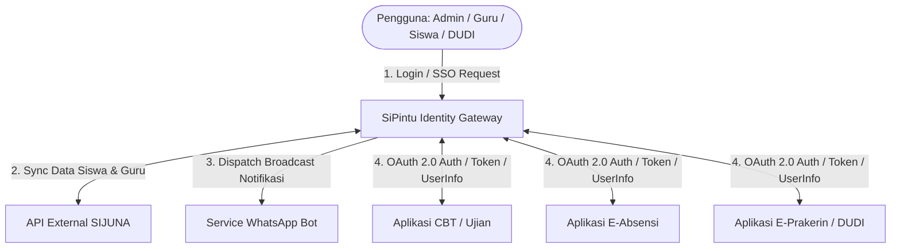
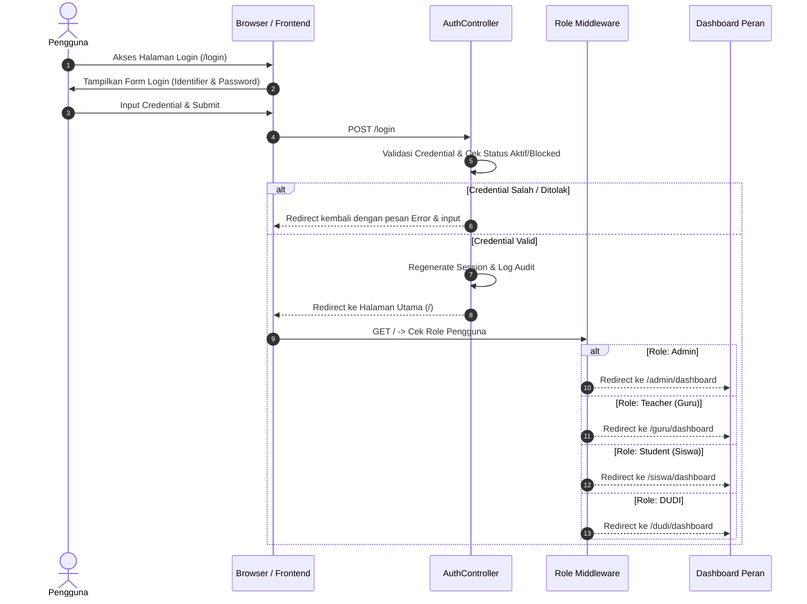
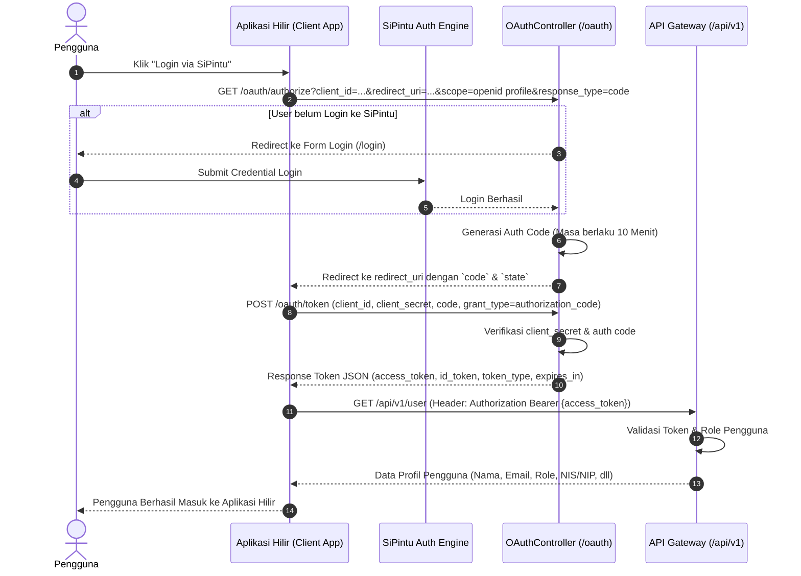
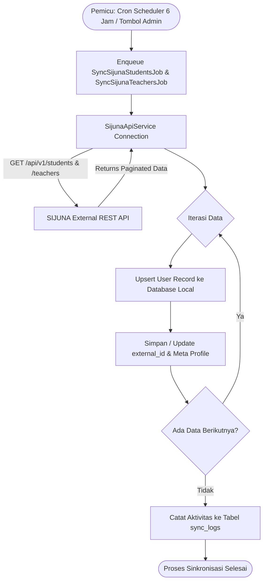
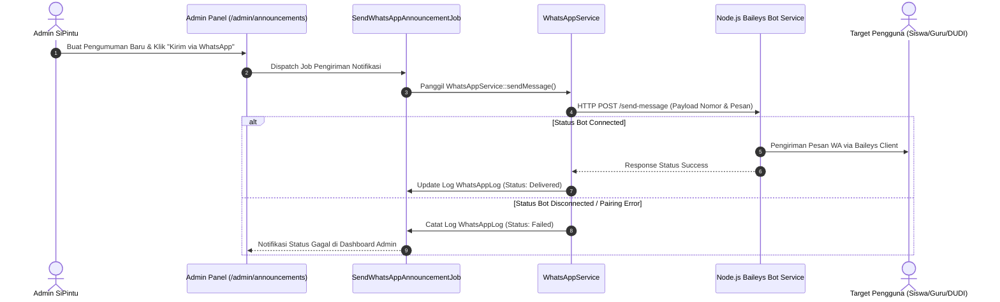
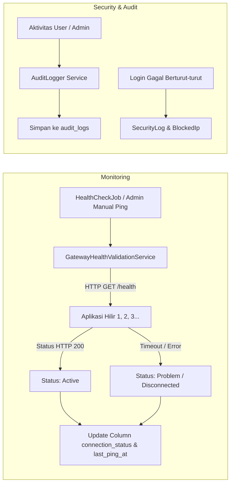

# Dokumentasi Alur Sistem Lengkap - SiPintu Identity Gateway

**SiPintu (Sistem Pintu Identity Gateway)** adalah platform identitas tersentralisasi (SSO / OAuth 2.0 / OpenID Connect Provider) yang mengelola autentikasi, otorisasi, sinkronisasi data dari SIJUNA, monitoring aplikasi hilir (*downstream apps*), serta pengiriman pengumuman via WhatsApp Bot.

---

## 📋 Daftar Isi
1. [Arsitektur & Konsep Utama Sistem](#1-arsitektur--konsep-utama-sistem)
2. [Alur Autentikasi Internal (Login Multi-Peran)](#2-alur-autentikasi-internal-login-multi-peran)
3. [Alur OAuth 2.0 & OpenID Connect (SSO Aplikasi Hilir)](#3-alur-oauth-20--openid-connect-sso-aplikasi-hilir)
4. [Alur Sinkronisasi Data SIJUNA (Siswa & Guru)](#4-alur-sinkronisasi-data-sijuna-siswa--guru)
5. [Alur Broadcast Pengumuman & WhatsApp Bot](#5-alur-broadcast-pengumuman--whatsapp-bot)
6. [Alur Monitoring Kesehatan Aplikasi & Audit Log](#6-alur-monitoring-kesehatan-aplikasi--audit-log)
7. [Matriks Peran & Hak Akses Sistem (RBAC)](#7-matriks-peran--hak-akses-sistem-rbac)
8. [Struktur Peta Rute & Middleware](#8-struktur-peta-rute--middleware)

---

## 1. Arsitektur & Konsep Utama Sistem

SiPintu berfungsi sebagai **Identity Provider (IdP)** utama untuk seluruh ekosistem aplikasi di lingkungan sekolah/institusi. 

---

## 2. Alur Autentikasi Internal (Login Multi-Peran)

SiPintu mendukung login multi-identifier yang disesuaikan dengan jenis akun/peran pengguna:

- **Admin**: Username / Email
- **Guru**: NIP / Email / Username
- **Siswa**: NIS / NISN / Email / Username
- **DUDI (Mitra)**: Kode DUDI / Email / Username

### Diagram Alur Login & Redireksi Peran

---

## 3. Alur OAuth 2.0 & OpenID Connect (SSO Aplikasi Hilir)

SiPintu menyediakan mekanisme **Single Sign-On (SSO)** standar industri menggunakan **OAuth 2.0 Authorization Code Grant** dan **OpenID Connect (OIDC)**.

### Sequence Diagram OAuth 2.0 / OIDC Flow

### Endpoints OIDC & Public Keys:
- **Discovery Endpoint**: `GET /.well-known/openid-configuration`
- **Public Keys (JWKS)**: `GET /oauth/jwks.json` (Untuk verifikasi tanda tangan digital `id_token` JWT oleh aplikasi klien)
- **Single Logout**: `POST /oauth/logout`

---

## 4. Alur Sinkronisasi Data SIJUNA (Siswa & Guru)

Data siswa dan guru pada SiPintu terintegrasi secara otomatis dengan **SIJUNA API** untuk menjamin konsistensi data entitas.

### Mekanisme Sinkronisasi:
1. **Otomatis (Scheduled Task)**: Berjalan setiap 6 jam via Laravel Scheduler (`routes/console.php`).
2. **Manual (Admin Trigger)**: Admin dapat memicu sinkronisasi kapan saja melalui panel `/admin/sijuna`.

---

## 5. Alur Broadcast Pengumuman & WhatsApp Bot

SiPintu dilengkapi dengan modul pengumuman tersentralisasi dan bot pengirim pesan WhatsApp berbasis Node.js (`whatsapp-bot`).

---

## 6. Alur Monitoring Kesehatan Aplikasi & Audit Log

SiPintu memantau status kesehatan (*health status*) dari seluruh aplikasi hilir terdaftar serta mencatat log audit keamanan.

---

## 7. Matriks Peran & Hak Akses Sistem (RBAC)

| Peran (Role) | Akses Dashboard | Kelola User | Kelola App & SSO | Sync SIJUNA | WhatsApp Broadcast | Akses App Hilir |
| :--- | :---: | :---: | :---: | :---: | :---: | :---: |
| **Admin** | `/admin/dashboard` | ✅ Full | ✅ Full | ✅ Trigger & View | ✅ Full Control | ✅ Semua App |
| **Guru (Teacher)** | `/guru/dashboard` | ❌ No | ❌ No | ❌ No | ❌ No | ✅ App Terotorisasi |
| **Siswa (Student)**| `/siswa/dashboard` | ❌ No | ❌ No | ❌ No | ❌ No | ✅ App Terotorisasi |
| **DUDI (Mitra)** | `/dudi/dashboard` | ❌ No | ❌ No | ❌ No | ❌ No | ✅ App Terotorisasi |

---

## 8. Struktur Peta Rute & Middleware

### Rute Utama & Autentikasi (`web.php`)
- `/login` & `/forgot-password`: Autentikasi Pengguna (Guest Only)
- `/profile` & `/applications/{app}/favorite`: Pengaturan Profil & Aplikasi Favorit (Auth Only)
- `/oauth/authorize`, `/oauth/token`, `/.well-known/openid-configuration`, `/oauth/jwks.json`: OAuth 2.0 / OIDC Engine

### Portal Spesifik Role (`web.php`)
- `/admin/*`: Middleware `['auth', 'role:admin']` (Manajemen Sistem, App, User, SIJUNA, Monitoring, Pengumuman)
- `/guru/*`: Middleware `['auth', 'role:teacher']` (Portal Guru & Aplikasi Terkait)
- `/siswa/*`: Middleware `['auth', 'role:student']` (Portal Siswa & Aplikasi Terkait)
- `/dudi/*`: Middleware `['auth', 'role:dudi']` (Portal DUDI & Aplikasi Terkait)

### REST API Gateway (`api.php`)
- `/api/v1/ping` & `/api/v1/validate-client`: Validation & Health Status Publik
- `/api/v1/user`, `/api/v1/user/profile`, `/api/v1/user/roles`: Data Pengguna via OAuth Bearer Token
- `/api/v1/sijuna/students`, `/api/v1/sijuna/teachers`: Data Sinkronisasi SIJUNA via Bearer Token

---

*Dokumen ini dibuat secara otomatis untuk memberikan gambaran alur kerja menyeluruh pada Sistem SiPintu Identity Gateway.*
