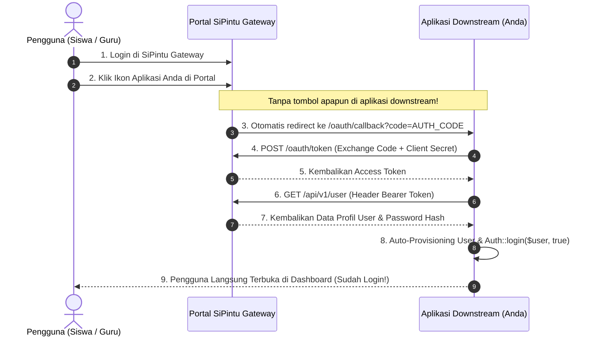

# 🚀 Panduan Integrasi API & Otomatisasi SSO SiPintu Gateway

Dokumen ini adalah panduan teknis resmi bagi pengembang (*developer*) untuk mengintegrasikan aplikasi eksternal / downstream (seperti **CBT, E-Absensi, Perpustakaan, Prestasi, Pilketos**, dll) dengan **SiPintu Identity & API Gateway**.

---

## 💡 Prinsip Utama: Tanpa Tombol Tambahan & SSO Otomatis

> ⚡ **PENTING UNTUK DEVELOPER DOWNSTREAM:**
> 1. **TIDAK PERLU MEMBUAT TOMBOL *"Login dengan SiPintu"***: Aplikasi downstream **tidak perlu** menambahkan tombol login baru maupun mengubah desain form login lokal yang sudah ada.
> 2. **SSO Berjalan Otomatis (Portal-Initiated)**: Pengguna (Siswa/Guru) cukup login di portal utama SiPintu, lalu ketika mengklik ikon aplikasi Anda di katalog SiPintu, mereka **langsung masuk ke dashboard aplikasi downstream Anda dalam keadaan sudah login** (*seamless login*).
> 3. **Dukungan Model Mandiri / Hybrid**: Form login lokal lama Anda (jika ada) tetap dapat digunakan normal tanpa terganggu.
> 4. **API Langsung Terhubung**: Akses data Siswa & Guru SIJUNA dapat langsung dipanggil dari backend (*Server-to-Server*) menggunakan kredensial Client ID & Client Secret.

---

## 🗝️ Langkah 1: Registrasi Aplikasi & Dapatkan Kredensial (CLI 3 Detik)

Buka terminal di folder root project `SiPintu` dan daftarkan aplikasi downstream Anda:

```bash
# Daftarkan aplikasi downstream baru:
php artisan sipintu:sso-client "Nama Aplikasi Anda" --redirect=http://localhost:8001/oauth/callback --base-url=http://localhost:8001
```

> **Hasil Output CLI:** Anda akan menerima **Client ID** (`app_...`) dan **Client Secret** (`sec_...`).

### Perintah CLI Pendukung di SiPintu:
| Perintah | Fungsi |
| :--- | :--- |
| `php artisan sipintu:sso-list` | Menampilkan tabel seluruh aplikasi downstream terdaftar & kredensialnya |
| `php artisan sipintu:client-check` | Memeriksa status koneksi, latensi, dan statistik request aplikasi downstream |
| `php artisan sipintu:sso-health` | Memverifikasi kesehatan routing OAuth, endpoint OpenID, JWKS, & CSRF bypass |

---

## ⚙️ Langkah 2: Pasang Konfigurasi Lingkungan (`.env`) di Downstream

Buka file `.env` pada **aplikasi downstream Anda**, lalu cukup tambahkan **4 baris variabel** berikut:

```env
# ===================================================
# KONEKSI SIPINTU GATEWAY & SSO
# ===================================================
SIPINTU_BASE_URL=https://sipintu.smkn1bangsri.sch.id
SIPINTU_CLIENT_ID=app_xxxxxxxxxxxx
SIPINTU_CLIENT_SECRET=sec_xxxxxxxxxxxxxxxxxxxxxxxxxxxx
SIPINTU_REDIRECT_URI=http://localhost:8001/oauth/callback
```

### Rincian Variabel:
| Variabel | Keterangan | Contoh |
| :--- | :--- | :--- |
| **`SIPINTU_BASE_URL`** | Alamat server SiPintu Gateway | `https://sipintu.smkn1bangsri.sch.id` atau `http://localhost:8000` |
| **`SIPINTU_CLIENT_ID`** | ID Pengenal aplikasi downstream Anda | `app_mecmvhpduc8e` |
| **`SIPINTU_CLIENT_SECRET`** | Kunci rahasia aplikasi downstream Anda | `sec_uEr8wGucp1jda8Ls6qOBsW03HrYVj6UK` |
| **`SIPINTU_REDIRECT_URI`** | URL callback di aplikasi Anda sendiri | `http://localhost:8001/oauth/callback` |

> ⚠️ **Penting:** Nilai `SIPINTU_REDIRECT_URI` harus mengarah ke domain/port aplikasi downstream Anda sendiri dan **wajib sama persis** dengan yang didaftarkan pada Langkah 1.

---

## 🔐 Langkah 3: Pasang SSO Otomatis (Cukup 1 Route & 1 Controller)

Aplikasi downstream Anda **hanya perlu menyediakan 1 endpoint Callback** untuk menerima lemparan otorisasi dari SiPintu Gateway.

### 1. Diagram Alur SSO Otomatis (Bebas Tombol)



---

### 2. Daftarkan 1 Route Callback (`routes/web.php`)

Tambahkan route berikut di file `routes/web.php` aplikasi downstream Anda:

```php
use App\Http\Controllers\OAuthController;

// Endpoint penerima redirect SSO otomatis dari SiPintu Gateway
Route::get('/oauth/callback', [OAuthController::class, 'callback'])->name('oauth.callback');
```

---

### 3. Buat Controller Callback (`app/Http/Controllers/OAuthController.php`)

Buat file baru di `app/Http/Controllers/OAuthController.php` aplikasi downstream Anda (Copy-paste kode berikut):

```php
<?php

namespace App\Http\Controllers;

use App\Models\User;
use Illuminate\Http\Request;
use Illuminate\Support\Facades\Auth;
use Illuminate\Support\Facades\Http;
use Illuminate\Support\Str;

class OAuthController extends Controller
{
    /**
     * Menerima otorisasi SSO otomatis dari Portal SiPintu Gateway
     */
    public function callback(Request $request)
    {
        // 1. Tangkap Authorization Code yang dikirim SiPintu
        $code = $request->input('code');

        if (! $code) {
            return redirect()->route('login')->with('error', 'Otorisasi SSO SiPintu gagal: Kode otorisasi tidak ditemukan.');
        }

        $baseUrl      = rtrim(env('SIPINTU_BASE_URL', config('services.sipintu.base_url', 'http://localhost:8000')), '/');
        $clientId     = env('SIPINTU_CLIENT_ID', config('services.sipintu.client_id'));
        $clientSecret = env('SIPINTU_CLIENT_SECRET', config('services.sipintu.client_secret'));
        $redirectUri  = env('SIPINTU_REDIRECT_URI', config('services.sipintu.redirect_uri'));

        // 2. Tukar Code dengan Access Token (Backend-to-Backend HTTP POST)
        $tokenResponse = Http::asForm()->acceptJson()->post("{$baseUrl}/oauth/token", [
            'grant_type'    => 'authorization_code',
            'client_id'     => $clientId,
            'client_secret' => $clientSecret,
            'redirect_uri'  => $redirectUri,
            'code'          => $code,
        ]);

        if ($tokenResponse->failed()) {
            $errorMsg = $tokenResponse->json('error_description') ?? 'Gagal memverifikasi token ke SiPintu Gateway.';
            return redirect('/login')->with('error', $errorMsg);
        }

        $accessToken = $tokenResponse->json('access_token');

        // 3. Ambil data profil pengguna dari SiPintu Gateway
        $userResponse = Http::withToken($accessToken)
            ->acceptJson()
            ->get("{$baseUrl}/api/v1/user");

        if ($userResponse->failed()) {
            return redirect('/login')->with('error', 'Gagal mengambil data akun dari SiPintu Gateway.');
        }

        $sipintuUser = $userResponse->json('data') ?? $userResponse->json();

        // 4. Auto-Provisioning & Pemetaan User Lokal
        // Akun otomatis dibuat jika belum ada, atau diupdate jika sudah ada
        $user = User::updateOrCreate(
            ['email' => $sipintuUser['email']],
            [
                'name'              => $sipintuUser['name'],
                'role'              => $sipintuUser['role'] ?? 'user',
                // Sinkronisasi password hash dari SiPintu sesuai kebijakan integrasi
                'password'          => $sipintuUser['password'] ?? bcrypt(Str::random(24)),
                'email_verified_at' => now(),
            ]
        );

        // Pastikan hash password lokal selalu sinkron jika user memperbarui password di SiPintu
        if (isset($sipintuUser['password']) && $user->password !== $sipintuUser['password']) {
            $user->update(['password' => $sipintuUser['password']]);
        }

        // 5. Loginkan pengguna ke sesi lokal aplikasi
        Auth::login($user, true);
        $request->session()->regenerate();

        // 6. Langsung arahkan ke Dashboard (Tanpa melihat form login!)
        return redirect()->intended('/dashboard')->with('success', "Selamat datang kembali, {$user->name}!");
    }
}
```

---

### 💡 (Opsional) Auto-Redirect Middleware untuk Akses Langsung

Jika aplikasi downstream Anda menginginkan **seluruh pengguna yang belum login langsung otomatis dialihkan ke SiPintu** saat membuka URL aplikasi (tanpa pernah melihat form login lokal):

Cukup tambahkan redirect di `routes/web.php` atau buat Middleware sederhana:

```php
// Jika user belum login mengakses halaman depan, langsung lempar ke SiPintu SSO
Route::get('/', function () {
    if (Auth::check()) {
        return redirect('/dashboard');
    }

    $query = http_build_query([
        'client_id'     => env('SIPINTU_CLIENT_ID'),
        'redirect_uri'  => env('SIPINTU_REDIRECT_URI'),
        'response_type' => 'code',
        'scope'         => 'openid profile email',
    ]);

    $baseUrl = rtrim(env('SIPINTU_BASE_URL'), '/');
    return redirect()->away("{$baseUrl}/oauth/authorize?{$query}");
});
```

---

## 🔄 Langkah 4: Pasang Webhook Sinkronisasi Otomatis Data Pengguna (Real-time)

> ⚡ **FITUR SINKRONISASI OTOMATIS (PUSH WEBHOOK):**
> Ketika data pengguna (nama lengkap, email, nomor HP/WhatsApp, kelas, role, foto profil, status, ataupun kata sandi) **diubah di SiPintu**, SiPintu akan **secara otomatis memancarkan request HTTP POST ke aplikasi downstream Anda**.
> Dengan memasang endpoint ini, data di database aplikasi downstream Anda akan **langsung terupdate seketika (*real-time*)** tanpa perlu menunggu user login ulang!

### 1. Daftarkan Route Webhook di Downstream (`routes/web.php` atau `routes/api.php`)

```php
use App\Http\Controllers\OAuthController;
use Illuminate\Foundation\Http\Middleware\PreventRequestForgery;

// Endpoint penerima pembaruan data user otomatis dari SiPintu Gateway
Route::post('/api/sipintu/sync-user', [OAuthController::class, 'syncUser'])
    ->withoutMiddleware([PreventRequestForgery::class]);
```

### 2. Tambahkan Method `syncUser` di `OAuthController.php`

Tambahkan method berikut ke dalam `app/Http/Controllers/OAuthController.php` aplikasi downstream Anda:

```php
    /**
     * Menerima payload pembaruan data pengguna realtime dari SiPintu Gateway
     */
    public function syncUser(Request $request)
    {
        // 1. Verifikasi Keamanan Signature HMAC SHA-256
        $signature = $request->header('X-SiPintu-Signature');
        $clientSecret = env('SIPINTU_CLIENT_SECRET');

        if ($signature && $clientSecret) {
            $computed = hash_hmac('sha256', $request->getContent(), $clientSecret);
            if (! hash_equals($computed, $signature)) {
                return response()->json(['status' => 'error', 'message' => 'Invalid signature'], 401);
            }
        }

        $userData = $request->input('user');
        $previous = $request->input('previous', []);

        if (! $userData) {
            return response()->json(['status' => 'error', 'message' => 'Missing user payload'], 400);
        }

        // 2. Temukan user berdasarkan email baru atau email lama jika user mengubah emailnya
        $user = User::where('email', $userData['email'])
            ->when(! empty($previous['email']), function ($q) use ($previous) {
                $q->orWhere('email', $previous['email']);
            })
            ->first();

        // 3. Siapkan data pembaruan
        $updateFields = [
            'name'  => $userData['name'],
            'email' => $userData['email'],
            'role'  => $userData['role'] ?? 'user',
        ];

        // Sinkronkan password hash jika ada (khusus non-admin)
        if (! empty($userData['password'])) {
            $updateFields['password'] = $userData['password'];
        }

        // Sinkronkan kolom opsional jika tabel users Anda memilikinya
        if (\Illuminate\Support\Facades\Schema::hasColumn('users', 'phone') && isset($userData['phone'])) {
            $updateFields['phone'] = $userData['phone'];
        }
        if (\Illuminate\Support\Facades\Schema::hasColumn('users', 'classroom') && isset($userData['classroom'])) {
            $updateFields['classroom'] = $userData['classroom'];
        }
        if (\Illuminate\Support\Facades\Schema::hasColumn('users', 'status') && isset($userData['status'])) {
            $updateFields['status'] = $userData['status'];
        }

        // 4. Update jika user sudah ada, atau buat baru jika belum pernah login
        if ($user) {
            $user->update($updateFields);
            $action = 'updated';
        } else {
            $updateFields['email_verified_at'] = now();
            if (empty($updateFields['password'])) {
                $updateFields['password'] = bcrypt(\Illuminate\Support\Str::random(24));
            }
            $user = User::create($updateFields);
            $action = 'created';
        }

        return response()->json([
            'status'  => 'success',
            'action'  => $action,
            'message' => "User {$user->email} berhasil disinkronkan di aplikasi downstream.",
            'user_id' => $user->id,
        ]);
    }
```

### 3. Struktur Payload JSON Webhook yang Dikirim SiPintu
```json
{
  "event": "user.updated",
  "event_id": "c76f6b57-d3bb-4d64-9276-88c278fb1234",
  "timestamp": "2026-09-07T13:15:00+07:00",
  "user": {
    "id": "10",
    "external_id": "12345678",
    "name": "Budi Santoso",
    "email": "budi@smkn1bangsri.sch.id",
    "username": "12345678",
    "role": "student",
    "classroom": "XII RPL 1",
    "phone": "081234567890",
    "status": "active",
    "avatar_url": "https://sipintu.smkn1bangsri.sch.id/storage/avatars/avatar.webp",
    "password": "$2y$12$e9qO8...",
    "password_hash": "$2y$12$e9qO8...",
    "password_sync_required": true,
    "updated_at": "2026-09-07T13:15:00+07:00"
  },
  "changed_fields": ["name", "phone", "classroom"],
  "previous": {
    "name": "Budi Lama",
    "phone": "0811111111",
    "classroom": "XI RPL 1"
  }
}
```

---

## 📡 Langkah 5: Pasang REST API SiPintu (Data Siswa SIJUNA & Guru)

Aplikasi downstream dapat langsung menarik data SIJUNA secara instan melalui REST API antar backend (*Server-to-Server*) tanpa login pengguna.

### Autentikasi Header Wajib
Setiap request ke endpoint REST API SiPintu wajib menyertakan header:
* `X-Client-ID`: Nilai `SIPINTU_CLIENT_ID` Anda
* `X-Client-Secret`: Nilai `SIPINTU_CLIENT_SECRET` Anda
* `Accept`: `application/json`

---

### Daftar Endpoint REST API Tersedia

| Method | Endpoint | Deskripsi | Parameter Query (Opsional) |
| :--- | :--- | :--- | :--- |
| `GET` | `/api/v1/ping` | Heartbeat & cek latency gateway | `?client_id=app_...` |
| `POST` | `/api/v1/validate-client` | Verifikasi validitas client credentials | Body JSON: `client_id`, `client_secret` |
| `GET` | `/api/v1/sijuna/students` | Daftar data Siswa SIJUNA lengkap | `?nis=...`, `?search=...`, `?limit=...` |
| `GET` | `/api/v1/sijuna/teachers` | Daftar data Guru SIJUNA | `?nip=...`, `?search=...` |

---

### Class Service Siap Pakai di Downstream (`app/Services/SiPintuService.php`)

Buat file `app/Services/SiPintuService.php` pada aplikasi downstream Anda:

```php
<?php

namespace App\Services;

use Illuminate\Support\Facades\Http;

class SiPintuService
{
    protected string $baseUrl;
    protected string $clientId;
    protected string $clientSecret;

    public function __construct()
    {
        $this->baseUrl      = rtrim(env('SIPINTU_BASE_URL', 'http://localhost:8000'), '/');
        $this->clientId     = env('SIPINTU_CLIENT_ID', '');
        $this->clientSecret = env('SIPINTU_CLIENT_SECRET', '');
    }

    /**
     * HTTP Client dasar dengan autentikasi header SiPintu Gateway
     */
    protected function client()
    {
        return Http::withHeaders([
            'X-Client-ID'     => $this->clientId,
            'X-Client-Secret' => $this->clientSecret,
            'Accept'          => 'application/json',
        ])->timeout(10);
    }

    /**
     * Ping / Heartbeat ke SiPintu Gateway
     */
    public function ping(): array
    {
        $res = Http::acceptJson()->get("{$this->baseUrl}/api/v1/ping", [
            'client_id' => $this->clientId,
        ]);

        return $res->json() ?? ['status' => 'offline'];
    }

    /**
     * Ambil data Siswa SIJUNA (Bisa filter NIS atau nama)
     */
    public function getStudents(?string $nis = null, ?string $search = null, int $limit = 50): array
    {
        $query = array_filter([
            'nis'    => $nis,
            'search' => $search,
            'limit'  => $limit,
        ]);

        $res = $this->client()->get("{$this->baseUrl}/api/v1/sijuna/students", $query);

        return $res->json('data') ?? ($res->json() ?? []);
    }

    /**
     * Ambil data Guru SIJUNA (Bisa filter NIP atau nama)
     */
    public function getTeachers(?string $nip = null, ?string $search = null): array
    {
        $query = array_filter([
            'nip'    => $nip,
            'search' => $search,
        ]);

        $res = $this->client()->get("{$this->baseUrl}/api/v1/sijuna/teachers", $query);

        return $res->json('data') ?? ($res->json() ?? []);
    }
}
```

### Contoh Pemanggilan API di Controller Downstream:
```php
use App\Services\SiPintuService;

class SiswaController extends Controller
{
    public function index(SiPintuService $sipintu)
    {
        // Ambil data 50 siswa pertama dari SIJUNA via SiPintu Gateway
        $siswa = $sipintu->getStudents(limit: 50);

        return view('siswa.index', compact('siswa'));
    }

    public function cariByNis(string $nis, SiPintuService $sipintu)
    {
        // Cari siswa spesifik berdasarkan NIS
        $siswa = $sipintu->getStudents(nis: $nis);

        return response()->json($siswa);
    }
}
```

---

## 🧪 Langkah 6: Pengujian via Terminal (cURL & CLI)

### 1. Uji REST API Siswa SIJUNA (cURL)
```bash
curl -s -X GET "https://sipintu.smkn1bangsri.sch.id/api/v1/sijuna/students?nis=12345" \
     -H "Accept: application/json" \
     -H "X-Client-ID: app_xxxxxxxxxxxx" \
     -H "X-Client-Secret: sec_xxxxxxxxxxxxxxxxxxxxxxxxxxxx"
```

### 2. Uji Status Koneksi dari Terminal SiPintu
```bash
php artisan sipintu:client-check --client-id=app_xxxxxxxxxxxx --secret=sec_xxxxxxxxxxxxxxxxxxxxxxxxxxxx
```

### 3. Uji Webhook Sinkronisasi Data Pengguna dari Terminal SiPintu
```bash
php artisan sipintu:sync-user "budi@smkn1bangsri.sch.id"
```

---

## ❓ Langkah 7: Troubleshoot & Solusi Masalah

| Error / Kendala | Penyebab | Solusi |
| :--- | :--- | :--- |
| **`invalid_client`** | Nilai `SIPINTU_CLIENT_ID` atau `SIPINTU_CLIENT_SECRET` di `.env` salah / tidak cocok. | Jalankan `php artisan sipintu:sso-list` di server SiPintu untuk memeriksa kredensial yang tepat. |
| **`redirect_uri_mismatch`** | Nilai `SIPINTU_REDIRECT_URI` di `.env` downstream tidak sama dengan yang didaftarkan di SiPintu. | Samakan URL callback hingga port dan protokolnya (misal `http://localhost:8001/oauth/callback`). |
| **`invalid_grant`** | Authorization Code sudah kadaluarsa (berlaku 5 menit) atau sudah pernah ditukarkan. | Cukup klik ulang ikon aplikasi dari Portal SiPintu untuk meminta code otorisasi baru. |
| **`CSRF token mismatch` pada POST `/oauth/token`** | Endpoint `/oauth/*` di SiPintu terhalang middleware CSRF browser. | Jalankan `php artisan sipintu:sso-health` untuk memastikan rute OAuth dikecualikan dari CSRF. |
| **Akun Siswa Belum Ada di Downstream** | Downstream belum memetakan user ke tabel lokal. | Gunakan fungsi `User::updateOrCreate()` pada `OAuthController` seperti contoh kode di atas. |
| **Data Diubah di SiPintu tapi Downstream Tidak Berubah** | Downstream belum menyediakan endpoint webhook `POST /api/sipintu/sync-user` atau base_url tidak bisa dijangkau. | Pasang endpoint `syncUser` sesuai Langkah 4 dan pastikan `SIPINTU_CLIENT_SECRET` cocok. Uji dengan `php artisan sipintu:sync-user`. |
