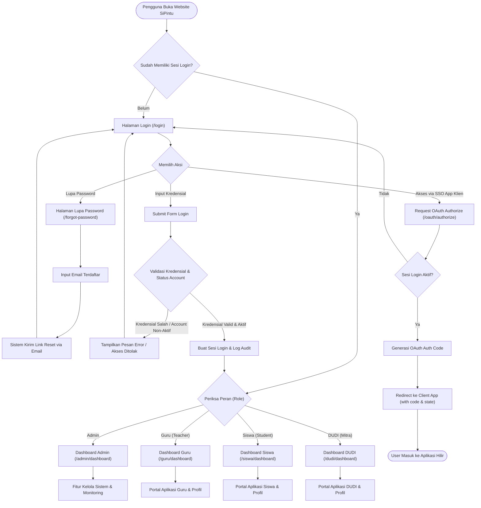
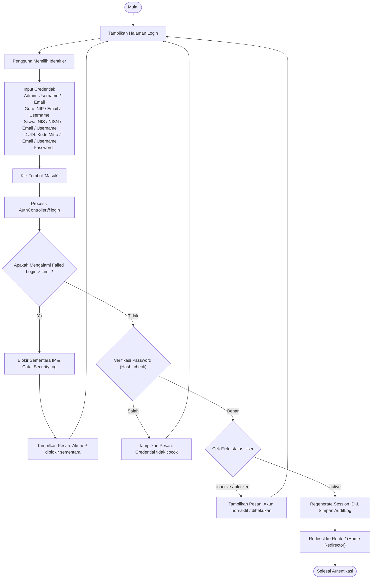
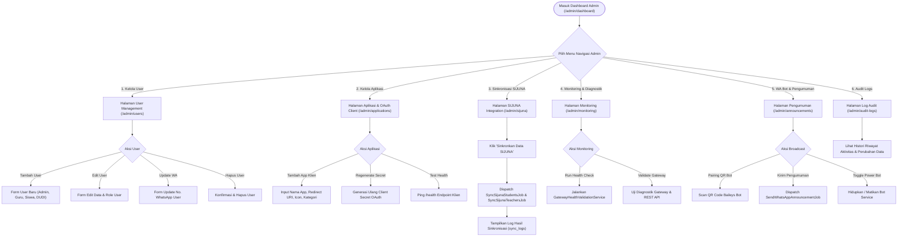
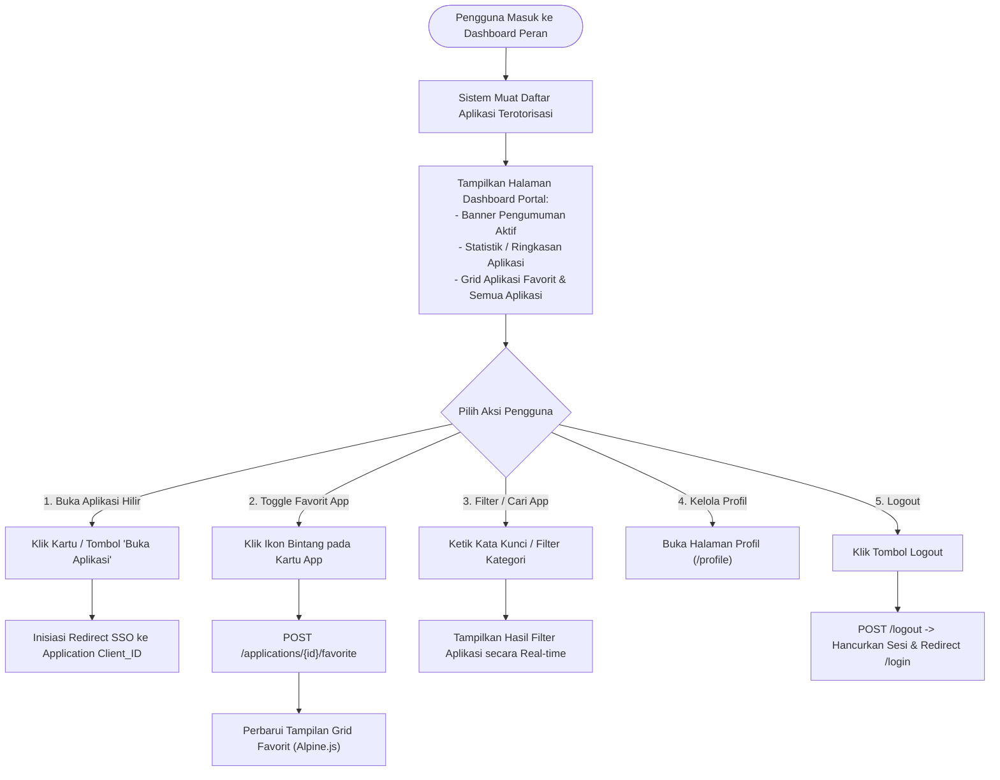
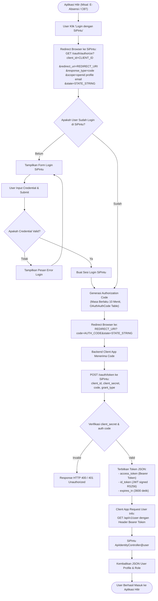
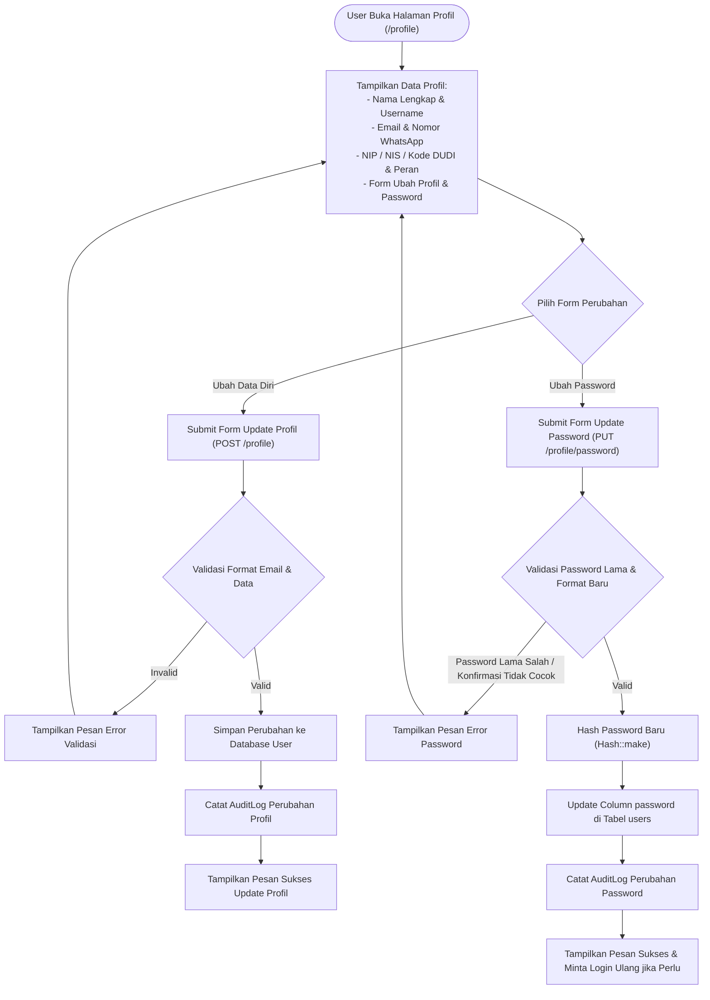

# Flowchart User Lengkap & Rinci - SiPintu Identity Gateway

Dokumen ini memuat **Flowchart User** secara komprehensif, mencakup seluruh alur perjalanan pengguna (*user journey*), titik keputusan (*decision points*), navigasi halaman, hak akses per peran, integrasi SSO, hingga fitur profil dan logout di **SiPintu Identity Gateway**.

---

## 📋 Daftar Isi
1. [Flowchart Utama Pengguna (End-to-End User Journey)](#1-flowchart-utama-pengguna-end-to-end-user-journey)
2. [Flowchart Detail: Autentikasi & Lupa Password](#2-flowchart-detail-autentikasi--lupa-password)
3. [Flowchart Detail: Portal Admin](#3-flowchart-detail-portal-admin)
4. [Flowchart Detail: Portal User Non-Admin (Guru, Siswa, DUDI)](#4-flowchart-detail-portal-user-non-admin-guru-siswa-dudi)
5. [Flowchart Detail: Single Sign-On (SSO) ke Aplikasi Hilir](#5-flowchart-detail-single-sign-on-sso-ke-aplikasi-hilir)
6. [Flowchart Detail: Manajemen Profil & Keamanan](#6-flowchart-detail-manajemen-profil--keamanan)

---

## 1. Flowchart Utama Pengguna (End-to-End User Journey)

Diagram di bawah ini menggambarkan alur perjalanan pengguna dari saat pertama kali mengakses website hingga masuk ke portal masing-masing atau menggunakan Single Sign-On (SSO).

---

## 2. Flowchart Detail: Autentikasi & Lupa Password

---

## 3. Flowchart Detail: Portal Admin

Admin memiliki kontrol penuh atas manajemen identitas, aplikasi klien, sinkronisasi SIJUNA, WhatsApp Bot, dan monitoring.

---

## 4. Flowchart Detail: Portal User Non-Admin (Guru, Siswa, DUDI)

Pengguna dengan peran Guru, Siswa, atau DUDI memiliki antarmuka yang bersih dan berfokus pada peluncuran aplikasi (*App Launcher*) serta pengelolaan profil.

---

## 5. Flowchart Detail: Single Sign-On (SSO) ke Aplikasi Hilir

Mekanisme otentikasi terpusat saat pengguna mencoba masuk ke aplikasi pihak ketiga / aplikasi hilir yang terintegrasi dengan SiPintu.

---

## 6. Flowchart Detail: Manajemen Profil & Keamanan

---

*Dokumen Flowchart User ini disusun secara mendalam untuk acuan pengembang, desainer sistem, maupun panduan pengguna SiPintu Identity Gateway.*
