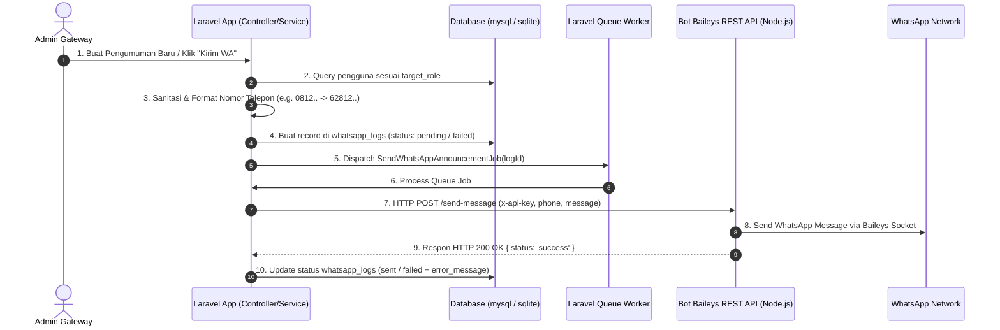

# 📢 Dokumentasi Integrasi WhatsApp Announcement (Laravel 12 + Baileys Bot)

Dokumen ini menjelaskan arsitektur, struktur folder, alur komunikasi, dan petunjuk operasional untuk fitur **Pengumuman WhatsApp** pada aplikasi **SiPintu**.

---

## 🏗️ 1. Struktur Folder & Komponen Utama

```
SiPintu/
├── app/
│   ├── Http/Controllers/Admin/
│   │   └── AdminAnnouncementController.php  # Handling request web UI pengumuman & WA dispatch
│   ├── Jobs/
│   │   └── SendWhatsAppAnnouncementJob.php # Queue Job pengiriman pesan secara asynchronous
│   ├── Models/
│   │   ├── Announcement.php                # Model Pengumuman
│   │   ├── User.php                        # Model User (menyimpan kolom phone)
│   │   └── WhatsAppLog.php                 # Model Log Pengiriman WhatsApp
│   └── Services/
│       └── WhatsAppService.php             # Formatting nomor HP, template pesan, HTTP Client ke Bot
├── config/
│   └── services.php                        # Konfigurasi WA_BOT_URL & WA_BOT_API_KEY
├── database/
│   └── migrations/
│       └── 2026_01_01_000011_create_whatsapp_logs_table.php  # Tabel log pengiriman
├── resources/views/admin/announcements/
│   ├── create.blade.php                    # Form buat pengumuman (+ pilihan WhatsApp)
│   ├── index.blade.php                     # Daftar pengumuman (+ tombol Kirim WA)
│   └── logs.blade.php                      # Halaman rincian status log pengiriman WA
├── routes/
│   └── web.php                             # Route admin pengumuman & WA logs
├── tests/
│   ├── Unit/WhatsAppServiceTest.php       # Unit Test untuk formatting nomor & template
│   └── Feature/WhatsAppAnnouncementTest.php# Feature Test untuk dispatching queue & HTTP mock
├── whatsapp-bot/                           # Microservice Bot WhatsApp Baileys
│   ├── auth_info_baileys/                 # Cache kredensial/session sesi WA (auto generated)
│   ├── index.js                            # Express server & REST API Baileys
│   ├── package.json                        # Dependensi Node.js (@whiskeysockets/baileys, express)
│   └── .env                                # Konfigurasi port & API Key bot
└── .env                                    # Environment Laravel
```

---

## 🔄 2. Alur Komunikasi (Laravel → Baileys → WhatsApp Network)



---

## 📱 3. Logika Format Nomor Telepon (Indonesian Standard)

Semua nomor telepon pengguna secara otomatis diproses melalui `WhatsAppService::formatPhoneNumber()`:
* `08123456789` &rarr; `628123456789`
* `+628123456789` &rarr; `628123456789`
* `628123456789` &rarr; `628123456789`
* `8123456789` &rarr; `628123456789`
* Nomor kosong, `null`, atau memiliki format tidak valid (&lt; 10 digit atau karakter non-numerik) **tidak akan dikirimkan** dan secara otomatis dicatat pada `whatsapp_logs` dengan keterangan error: *"Nomor telepon pengguna kosong atau tidak valid."*

---

## ✉️ 4. Format Pesan WhatsApp

Pesan yang dikirimkan ke pengguna mengikuti format baku berikut:

```text
📢 PENGUMUMAN

Halo, {Nama User}

{Isi Pengumuman}

Terima kasih.
```

---

## ⚙️ 5. Konfigurasi Environment (`.env`) //skip//
### Bot Baileys `whatsapp-bot/.env`:
```env
PORT=3000
//
---
//

## 🚀 6. Cara Menjalankan Bot Baileys & Laravel Secara Bersamaan

### Langkah 1: Jalankan Bot WhatsApp Baileys (Terminal 1)
```bash
cd whatsapp-bot
npm start
```
> **Catatan Authentication WhatsApp:**
> Saat pertama kali dijalankan, QR Code akan muncul di terminal. Buka aplikasi WhatsApp di HP Anda &rarr; Perangkat Tertaut (Linked Devices) &rarr; **Tautkan Perangkat** & scan QR Code tersebut. Sesi login akan disimpan secara permanen di folder `whatsapp-bot/auth_info_baileys/`.

### Langkah 2: Jalankan Laravel Queue Worker (Terminal 2)
```bash
php artisan queue:work --tries=3 --backoff=10
```

### Langkah 3: Jalankan Web Server Laravel (Terminal 3)
```bash
php artisan serve
```

---

## 🧪 7. Menjalankan Unit & Feature Testing

Untuk memastikan seluruh pengujian otomatis berjalan dengan sukses:

```bash
# Menjalankan Unit Test (Format Nomor & Template Pesan)
./vendor/bin/phpunit tests/Unit/WhatsAppServiceTest.php

# Menjalankan Feature Test (Queue Dispatch & HTTP Mock)
./vendor/bin/phpunit tests/Feature/WhatsAppAnnouncementTest.php
```

---

## 🛡️ 8. Fitur Error Handling & Security Best Practices
1. **Pencegahan Blocking UI:** Pengiriman pesan menggunakan Laravel Queue (`database` driver) sehingga pengiriman massal ke ribuan user berjalan secara asynchronous di background tanpa memperlambat aplikasi.
2. **API Key Authentication:** Endpoint Bot `/send-message` dilindungi oleh API Key (`x-api-key` header).
3. **Penyimpanan Status Log:** Setiap pengiriman pesan ke tiap user dicatat statusnya (`pending`, `sent`, `failed`) beserta pesan error lengkap apabila koneksi bot terputus atau nomor tidak terdaftar.
4. **Audit Logging:** Setiap aksi pengiriman WhatsApp dicatat pada tabel `audit_logs` untuk pertanggungjawaban admin.
